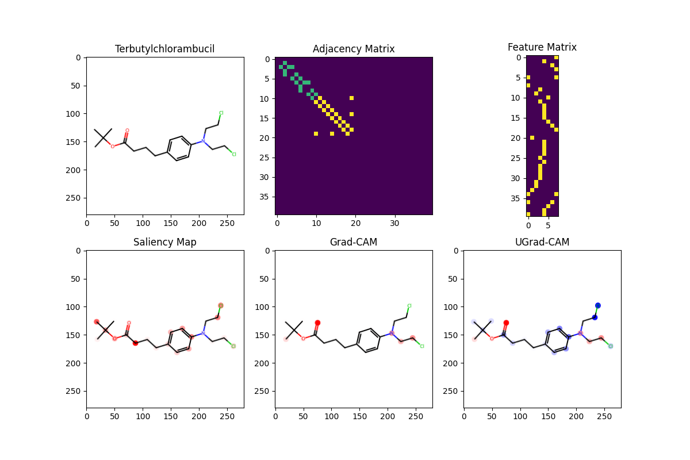

# GCNN-Explainability
This repository contains the code for GCNN-Explainability, published in 2019.
https://github.com/ndey96/GCNN-Explainability
# Requirement
* PyTorch
* Python
* RDKit
# Installation
* If you do not have any graphic driver, you can use Keggle or Google Colab
* Clone git

```sh
!rm -r Graph-
!git clone https://github.com/Nappleee/Graph-
%cd Graph-/
```


* Install requirements

```sh
!pip install torch_geometric
!pip install rdkit
!pip install cairosvg
```


* Run training file
```sh
!python train.py
```

* Run explaination file(you need to run train.py before running this) 
```sh
!python explain.py
```


